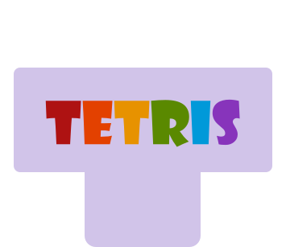
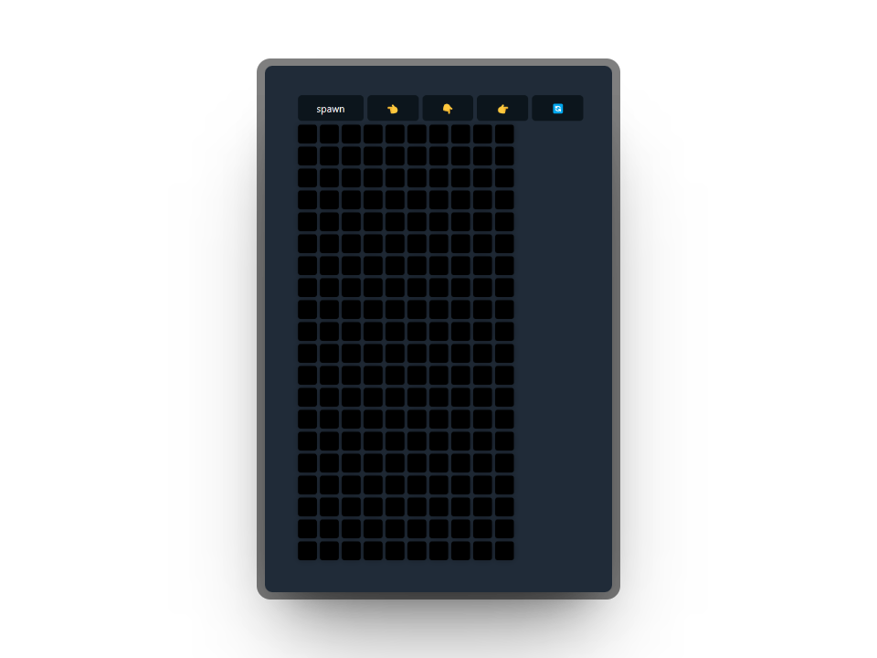

# Tetris

[👆 Live Demo](https://)

Simple Tetris that I made that uses `zustand`

<video src="screenshots/tetris.mp4" controls title="Title" height="400" />

## Features

-   Spawn a Tetrominoe in the Board
-   Allows you to move and rotate the shape

## Getting Started

### Prerequisites

-   Node.js (v14 or higher)
-   npm or pnpm or yarn

### Installation

1. Clone the repo: `git clone https://github.com/rivasjoaquin02/tetris`
2. Install dependencies: `pnpm install`
3. Start the development server: `pnpm run dev`
4. Open `http://localhost:5173` with your browser to see the result.

## Contributing

Contributions are welcome!

## License

This project is licensed under the MIT License - see the [LICENSE.md](LICENSE.md) file for details.
